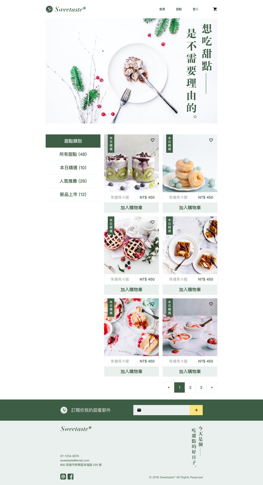
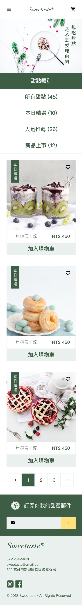

# 切版任務一 - 產品列表

## 內文索引
  - [概述](#概述)
    - [任務要求](#任務要求)
    - [螢幕截圖](#螢幕截圖)
    - [作品連結](#作品連結)
  - [過程](#過程)
    - [所用工具](#所用工具)
    - [學習到的是...](#學習到的是...)
    - [可以優化的地方](#可以優化的地方)
    - [參考資源](#參考資源)
  - [作者](#作者)
  - [感謝](#感謝)

## 概述

### 任務要求

切版，勁量與設計稿一致，中間區塊需要錄影呈現

### 螢幕截圖

### 作品連結

- [Github repo](https://github.com/Beginneraboutlife116/Layout-mission-one-Sweetaste)
- [Live Site URL](https://beginneraboutlife116.github.io/Layout-mission-one-Sweetaste/)
- [錄影](https://www.youtube.com/watch?v=pLGCN_iH6e0)

## 過程

### 所用工具

- Semantic HTML5 markup
- CSS custom properties
- Flexbox
- CSS Grid
- Mobile-first workflow
- Sass

### 學習到的是...

蠻多關於Sass的部分都有去嘗試，如`@mixin`, `@extend`, `@include`, `@each`, `@if`, `@else`等。
 - 在這邊也嘗試利用`@mixin`帶入optional arguments的方式來去改變width的值，但失敗了，所以後來改用if-else來處理不同輸入值的輸出狀況

並且也比較清楚明白**7 - 1 pattern**的管理方式。
 - 雖然在layout以及component上仍有一些狀況不太容易分清楚，這次實作主要是思考reusability來分類的。

另外在CSS上，多嘗試logical property的寫法，`inline`, `block`等方式，並使用`min()`, `clamp()` function來管理RWD

### 可以優化的地方

未來會希望可以把其他的設計稿也切完，並且考慮使用React來做一個SPA。

### 參考資源

- [Sass](https://sass-lang.com/) - Sass官方

## 感謝

[六角學院 - 【公益程式體驗營】擺脫動亂學前端， 掌握技能保平安](https://www.hexschool.com/2022/03/18/2022-03-18-global-welfare/)